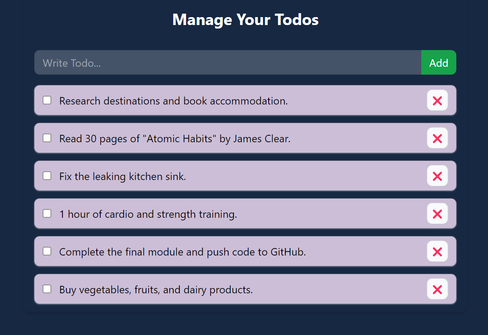

# React To Do App

A simple To-Do application built using React, Tailwind CSS, Context API, and Local Storage. This app allows users to manage their tasks efficiently, with features like adding, deleting, and persisting tasks across sessions.

## Features

- **Add To-Dos:** Easily add new tasks to your list.
- **Delete To-Dos:** Remove tasks that are completed or no longer needed.
- **Persistent Storage:** Tasks are saved in the browser's local storage, so they persist even after the page is refreshed.
- **tyle:** Styling using Tailwind CSS.
- **Context API:** Manage state globally for a seamless user experience.

## Screenshot

## Technologies Used

- **React:** A JavaScript library for building user interfaces.
- **Tailwind CSS:** A utility-first CSS framework for styling.
- **Context API:** A React feature for managing global state.
- **Local Storage:** A web storage API for persisting data.

## License

This project is licensed under the MIT License - see the [LICENSE](LICENSE) file for details.

## Contact

- **Name:** Muhammad Awais Arshad
- **GitHub:** [awaisarshad819](https://github.com/awaisarshad819)
- **Email:** [awaisarshad819@gmail.com](mailto:awaisarshad819@gmail.com)
- **LinkedIn:** [Muhammad Awais Arshad](https://www.linkedin.com/in/muhammadawais-arshad/)
